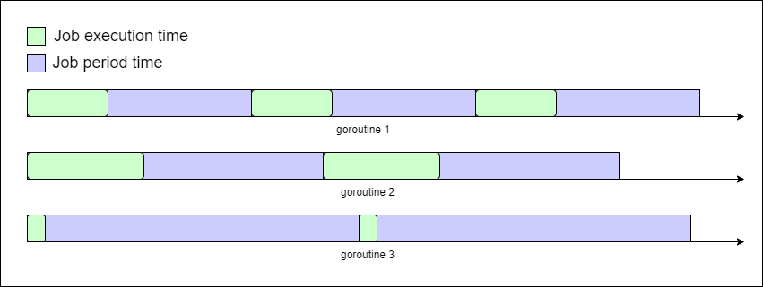

# Cron scheduler

## Definitions of some important components

### Job
A job in this project referes to a go function that expects no parameters and returns nothing.

### Decorated job
A decorated job in this project refers to a job whose code has been modified in order to satisfy certain prerequisities. 

First, a job code is wrapped in a `timer`. This adds logic to calculate and log the job execution time, and it also sends the job goroutine to sleep for the remaining of the scheduling period time. It also makes sure that a single job execution does not exceed its expected time (i.e., its timeout value).

Second, the looper adds some code to the timed job that repeats the job code as long as needed.

Third, the handler adds code to the looped job that makes sure that any errors in the job goroutine do not stop the execution of the whole program but are logged instead.


### Logger
This is a utility that logs information to a designated output. The output could be either a file on the disk or the os standard output. The logger has three logging levels info, warn, and error.

### Cron job pool
This is a table that is a part of the scheduler. It contains the following infromation:
1. the identifiers of the jobs registered in it, 
2. their respective states (i.e., their schedule is running or not), 
3. and the decorated code of each job. 

A cron job pool example is presented in the table below:

| identifier | running | decorated job      |
|------------|---------|--------------------|
| 1          | true    | [decorated code 1] |
| 2          | false   | [decorated code 2] |
| 9          | true    | [decorated code 3] |

## Brief description and snippets

Cron scheduler is an in-process scheduler that accepts jobs and runs them periodically. A cron object comprises a logger, and a job pool.

In order to schedule a job to run periodically by cron, you have to do the following:

1. Create a new cron instace. If you pass a file name to the constructor function, cron will log to a file with that passed name created in logs folder. If no file name is passed, cron will log to the standard output.
```go
c := cron.NewCron("file")
```

2. Register the job to cron job pool.
```go
c.AddJob(0, time.Millisecond*1000, func() {
    fmt.Println(1)
}, 1)
```
3. Run the registered job by its respective identifier
```go
c.RunJob(1)
// or you can run all registered non-scheduled jobs
c.RunAll()
```
4. Wait for the running jobs.
```go
// this runs all scheduled jobs until the user clicks "enter" button
c.WaitJobs()
```

In order to stop a scheduled job from running, you can do the following:
```go
c.StopJob(1)
// or you can stop all registered scheduled jobs
c.StopAll()
```

P.S. Each function mentioned above has verbose documentation on their parameters and return values as comments in the code. I suggest to check it out as well.

## Decisions and tradeoffs
Java was an alluring language to me to solve the challenge because I have years of experience with its data structures and syntax from the university. However, I decided to go with `golang` although I had zero experience in it when I was making my decision. The only thing I knew about `golang` was that it is optimized for concurrency. That is why I decided to learn more about it and eventually use it.

After doing some research, I learnt the following:
1. Goroutines are lighter in terms of memory consumption compared to Java threads.
2. It is easy to orchestrate concurrent tasks and share data safely between goroutines using channels for communication.
3. Java code is usually more complex than golang when writing concurrent programs.
4. Go's runtime can automatically schedule goroutines across multiple processor cores, providing parallelism automatically.
5. Go's garbage collector is designed to work well with concurrent programs.
6. Goroutines have a more efficient context-switching mechanism compared to traditional threads.

After that, I designed the way a job schedule should run. In order to schedule a job, its code would need some decorations first. Then, each decorated job would run in its own goroutine. An example time diagram of running 3 decorated jobs in 3 separate goroutines is presented below.



The tests, found in `shceduler/cron_test.go`, were then designed to cover as much as possible from the implemented code and as many corner cases as possible. 

In order to run the tests, go to the project root directory and run the `run_tests.sh` script. The tests would take less than a minute, and at the end, a coverage report opens in your default browser.

## Possible future improvements
1. The cron `WaitJobs()` function could be improved by having an additional option to stop cron programmatically than having just the option to wait for the user input in order to stop code execution.
2. Cron could be extended to support jobs written in different languages and not just `golang` jobs.
3. Another extension to the project could be to allow for registering and scheduling jobs during the project runtime (through standard input or any other input medium).